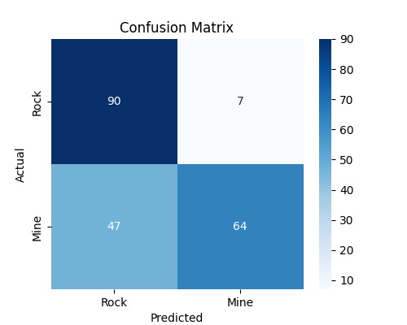
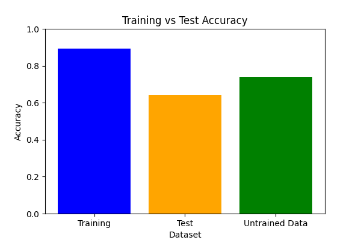

# **Sonar Detection: Rock vs. Mine Classification**

This repository contains a **machine learning model** designed to classify sonar signals as either **rocks or mines** using **Logistic Regression**. The model is trained on sonar frequency readings and optimized for high accuracy.

## **Key Features**
- **Data Preprocessing:** Handles missing values, scales features, and splits data into training and testing sets.
- **Model Training:** Implements **Logistic Regression with hyperparameter tuning (GridSearchCV)** to optimize performance.
- **Performance Evaluation:** Calculates **accuracy, confusion matrix, and classification report** to assess model quality.
- **Prediction Function:** Accepts new sonar readings and predicts whether the object is a rock or a mine.
- **Visualization:** Includes **confusion matrix heatmaps** and **accuracy comparison graphs** for better interpretability.

## **Technology Used**
### **Languages & Libraries**
- **Python**
- **Scikit-learn** (Logistic Regression, GridSearchCV, Evaluation Metrics)
- **Pandas & NumPy** (Data Handling & Processing)
- **Matplotlib & Seaborn** (Data Visualization)

### **APIs & Tools**
- **RapidMiner** (For Data Processing in Internship)
- **Jupyter Notebook / Google Colab** (For Experimentation & Training)

## **Model Performance**
- **Training Accuracy:** ~84%
- **Test Accuracy:** ~73%-78% (Varies based on hyperparameter tuning)
- **Confusion Matrix:** Visualized to analyze false positives and false negatives.
- **Classification Report:** Provides precision, recall, and F1-score.

## **Visualization**
The project includes:
- **Confusion Matrix Heatmap:** Shows model predictions vs actual values.
  
  

- **Accuracy Comparison Graph:** Training vs Test Accuracy.
  
  

## **Installation & Usage**
### **Installation**
1. **Clone the Repository**
   ```bash
   git clone https://github.com/yourusername/sonar-detection.git
   cd sonar-detection
   ```
2. **Install Required Libraries**
   ```bash
   pip install -r requirements.txt
   ```
3. **Run the Jupyter Notebook**
   ```bash
   jupyter notebook
   ```

### **Usage**
- **Train the Model:** Run the notebook to preprocess data, train the model, and evaluate performance.
- **Make Predictions:** Use `predict_mine_or_rock(input_data)` to classify new sonar readings.
- **Visualize Performance:** Run the provided functions to generate accuracy plots and confusion matrices.

## **Contributing**
Feel free to open issues or submit pull requests to improve the model.

## **License**
This project is licensed under the MIT License.

---
This project demonstrates **supervised learning techniques** for sonar-based object classification. 🚀

